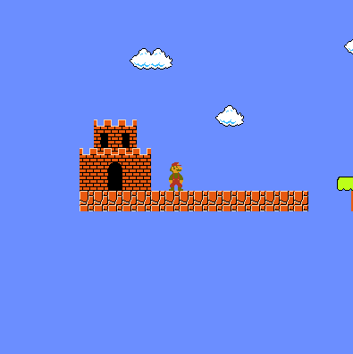
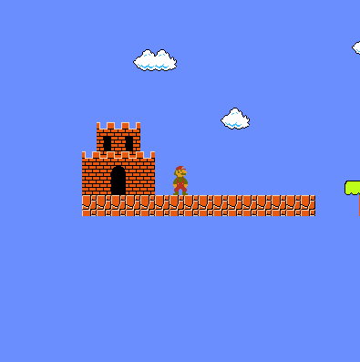

# Marionette

This is a shameless mario clone.
It is written entirely in Python (version 3.7),
featuring a tiny homebrew engine written from scratch.
Graphics and user input are done via the excellent SDL library,
using the standard ctypes module for language bindings.

### Running
To run the project, simply start it using the Python interpreter,
version 3.7 or higher should work.

### Demos

When Mario falls from a high place, he gets "stunned" and becomes
unable to move for a bit:

